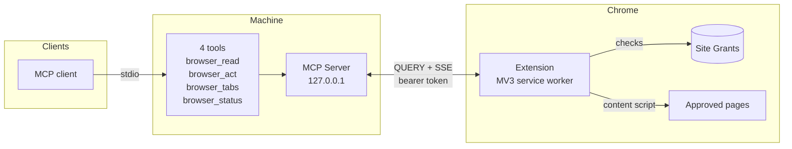

<p align="center">
  
</p>

<h1 align="center">browsight</h1>

<p align="center">
  Give any AI agent access to your signed-in Chrome, on the exact sites you choose.
</p>

<p align="center">
  <a href="https://www.npmjs.com/package/browsight"></a>
  <a href="https://www.npmjs.com/package/browsight"></a>
  <a href="https://github.com/anexinwilson/browsight/actions/workflows/release.yml"></a>
  <a href="https://sonarcloud.io/summary/new_code?id=anexinwilson_browsight"></a>
  <a href="LICENSE"></a>
</p>

---

**Give your AI agent the Chrome you are already signed into, without giving it your whole browser.**

```sh
npx -y browsight setup
# -> finds your MCP clients, registers browsight
```

Browsight is an MCP server, so it works with Claude Code, Cursor, Codex, Windsurf, Antigravity, Claude Desktop, or anything else that speaks the protocol. One install, no vendor lock-in, and it carries over to whichever agent you use next.

It connects that agent to a tab already open on your machine, with your sessions, cookies, and extensions intact, so it can work on the sites you are already logged into. Nothing to log into again, no login script, no credentials stored anywhere. **An agent cannot go rogue in here.** It does not get your browser, it gets the sites you allowed and nothing else, and its entire vocabulary is four tools: read a page, act on one, list your tabs, and report its own status. No shell, no filesystem, no downloads, no installs. Even a jailbroken model has nowhere to go.

If you are developing a frontend, the widely used automation tools are Playwright and Cypress. Since they bring their own Chrome, they cannot open a signed-in page or anything behind a Stripe paywall, which leaves them on your homepage and whatever else is public. Getting past that means scripting the sign-in and seeding a paying test account first.

Browsight is already signed in and already on your plan, because it is the browser you are sitting in. After a change an agent can walk every route, click every button, fill and submit every form, and tell you what broke.

**You decide what it sees, from a real UI.** Setup installs a Chrome extension with a popup, and that popup is the whole permission system. Open it on a site and grant **read-only** or **full control**, with an inactivity expiry if you want one, and revoke there any time. The agent cannot grant itself more, because the list lives in the extension rather than in the model's judgement. Your email sits in the next tab and stays invisible.

Free, fully open source under MIT, and self-hosted. It runs entirely on your machine, with no account, no API key, no quota, and no page content going anywhere except the model your client already talks to.

---

## 1. Core Problem & Motivation

An agent is far more useful once it can see your browser, because that is where the work is. The reason most people never connect one is that your browser is also where everything else is. Giving an agent Chrome means giving it your email, your bank, your company's admin panel, all sitting one tab away, and then hoping it behaves and that no page talks it into something you did not ask for. That is a lot to hope for, so the sensible answer is usually no.

### What is available today

**Hosted browser APIs** run browsers in their own cloud for a fee. It is their browser, signed in as nobody, so it sees public pages only, and Cloudflare blocks it routinely because nothing about it looks like a real user.

**Claude in Chrome and Codex for Chrome** also use the Chrome you are signed into, and both ask before they act. Any site is fair game though, approved in the moment rather than set up in advance, a few stay blocked no matter what you do, and each only works inside its own product. **Antigravity** opens a Chrome profile of its own instead, so your logins are not in it.

**Playwright and Cypress** are the right tools for automated frontend testing, and Browsight does not replace them. Bringing their own Chrome does mean signed-in routes and Stripe-gated pages stay out of reach until you script the sign-in and seed a subscriber account matching your production plan.

### What Browsight does

It uses the Chrome you are already in, and limits the agent to the sites you allow from the extension popup. Everything starts blocked, you approve what you want as read-only or full control, and it cannot reach past that or grant itself more.

---

## 2. Quick Start

**1. Run setup**

Requires Node.js 24 or later.

```sh
npx -y browsight setup
```

That one command is the install. `npm i browsight` only downloads the package, so run setup after it if you install that way.

Generates an auth token, picks a free loopback port, copies the extension to `~/.browsight/extension`, and registers Browsight with every MCP client it finds (Claude Code, Cursor, Windsurf, Codex, Antigravity). Re-running reuses the same token and port.

**2. Load the extension**

1. Open the Chrome menu (three dots, top right) and go to **Extensions** > **Manage extensions**
2. Turn on **Developer mode**, top right
3. Click **Load unpacked** and select `~/.browsight/extension`, the folder setup printed
4. Restart your MCP client

**3. Pin Browsight to the toolbar**

Open the Chrome menu, go to **Extensions**, select **Browsight**, and pin it so the icon stays visible. The popup is the only place permissions are granted, so you want it one click away.

**4. Allow a site**

Open a site, click the Browsight icon, and choose **Read-only** or **Full control**.

### Commands

```sh
npx browsight                    # same as setup, the default command
npx browsight setup              # configure clients and install the extension
npx browsight setup --new-port   # move to a free port if the old one is stuck
npx browsight doctor             # check the installation end to end
npx browsight serve              # start the server manually
```

`serve` takes `--idle-timeout <minutes>` (default 30) to control how long the server holds its port with no site access. `0` disables the shutdown. Your MCP client starts the server for you, so `serve` is only needed when running it by hand.

`doctor` reports on the build, the bridge config, the extension connection file, and whether Browsight is registered in a client config, then names the first broken link:

```
[ok] server built (server/dist/index.mjs)
[ok] extension built (extension/dist/manifest.json)
[ok] bridge config written (~/.browsight/bridge.json)
[ok] extension connection.json written
[ok] MCP server registered in a client config

All links connected. If a read still fails, whitelist the site in the browsight popup.
```

---

## 3. Permissions

The extension is the permission layer. Every call from the agent goes through it.

| Action | Effect |
|---|---|
| **Allow read-only** | Agent can read page content, structure, and data |
| **Allow full control** | Agent can read, click, type, navigate, and scroll |
| **Set an expiry** | Grant lapses after 1, 2, 4, or 12 hours of inactivity, or never |
| **Revoke** | Removes access immediately |

No config files, no environment variables, no restart. Every other tab stays completely private.

Grants are **per origin**, and a subdomain is a different origin. Allowing `example.com` does nothing for `login.example.com`, so an agent that follows a link onto an unapproved subdomain is stopped and told which origin to allow. That happens whether the destination is checked before the click or the page moves on its own afterwards.

---

## 4. Use Cases

### For web developers: checking your own app

You push a change and want to confirm nothing broke across your authenticated routes, subscriber-only pages and payment-gated features. Playwright and Cypress cannot reach those without a scripted login and a test account matching your production plan, which is a lot of setup when the question is whether one button still works.

Allow your staging app in the extension. The agent can:

- Visit every route (authenticated, admin, subscriber-only) with no login script
- Click every button and fill every form across the full product surface
- Hit Stripe-paywalled pages using your real account and plan
- Report exactly what broke and why

```
> "Walk the whole app signed in as me. Every route, every form, every button. Tell me what is broken."

"4 issues. Reports sends `startDate`, API reads `from`. Avatar upload POST
 returns 413. Change plan links to /billing/upgrade which does not exist.
 Admin pagination passes page=2 as a string."
```

No selectors. No credentials. No Stripe test mode.

> Runs are not deterministic. This is for the manual smoke-testing you would have done yourself, not a replacement for your Playwright CI suite.

### Research without bot detection

Headless browsers with no session get blocked by Cloudflare because there is nothing about them that looks like a real user. Browsight uses the Chrome you are already in. Approve a site and the agent can pull structured data, compare listings, or monitor changes without hitting a wall or paying per page.

Browsight is your own browser, with your session and your history, so approved sites serve it the pages they serve you rather than the block page they serve a scraper. The agent can pull structured data, compare listings across several sites, or check what changed, without a scraping subscription or a per-page bill.

### Other tasks

- Filling long forms and multi-step applications on sites you are signed into
- Reading across a fixed set of approved documentation sites while you work
- Checking what changed on a dashboard since yesterday

---

## 5. Tools

```
browser_read { mode? }                 Read the selected tab (full or main)
browser_act { ref, action, value? }    Click, fill, navigate, scroll
browser_tabs { select?, read? }        List or switch to an approved tab
browser_status { reload? }             Connection health and active grants
```

---

## 6. Architecture



- The agent gets exactly four tools: `browser_read`, `browser_act`, `browser_tabs`, `browser_status`. That is the entire surface.
- MCP clients talk to the server over **stdio**. No open port, no network exposure.
- The server talks to the extension over **HTTP `QUERY` + SSE on `127.0.0.1`** with a bearer token.
- The extension checks the grant store on every call before touching a page.
- Commands flow server to extension over SSE. Results flow back as HTTP `QUERY`, which carries a structured body rather than cramming it into a URL.
- `QUERY` is the only method the bridge answers. Everything else is refused before the token is read, so the surface a page can reach at all is one method on one loopback port.
- The server binds its port only when a browser tool is actually called, and releases it after `--idle-timeout` minutes (default 30), so two MCP clients can be open without conflicting.
- A watchdog polls the launching client's PID and exits if it dies, so a crashed editor cannot leave a server holding the port.
- The extension reconnects over SSE with backoff when the service worker is woken, instead of retrying in a tight loop.

### Stack

| Layer | Choice |
|---|---|
| MCP transport | stdio |
| Server | Node 24, TypeScript, `@modelcontextprotocol/sdk` |
| Server to extension | HTTP `QUERY` + SSE on `127.0.0.1` |
| Extension | Chrome MV3, service worker, no `debugger` permission |
| Page reading | Accessibility tree (roles + names, not raw HTML) |
| Contracts | Zod schemas shared between server and extension |
| Tests | `node:test` + jsdom, 249 tests across 40 files |
| Security scanning | Snyk SCA and SAST, SonarCloud, Gitleaks |
| CI/CD | GitHub Actions with SHA-pinned actions, npm publish with provenance over OIDC |

### Page to text

Raw HTML is expensive. A typical authenticated dashboard runs 30,000 to 100,000+ tokens of scripts, styles and hidden nodes. Browsight walks only visible nodes, open shadow roots and same-origin frames, taking the accessibility role and name of each element.

The same inbox as accessibility output:

```
Token estimate: ~34

# Inbox
3 unread messages
[button "Compose" #5]
[textbox "Search mail" #6]
[link "Stripe receipt" #7]
```

Headings come through as markdown, long runs of digits are dropped as noise, and an oversized page ends with a truncation marker rather than being silently cut. `mode: "main"` targets the primary landmark or any open dialog; `mode: "full"` takes the page.

### References that survive a re-render

Each interactive element carries a durable reference: role, accessible name, data attributes, surrounding text, and index among elements sharing that role and name. If the stored element has drifted after a React or Vue re-render, the reference re-resolves by narrowing candidates on each of those in turn. An ambiguous match fails with a descriptive error rather than clicking the wrong target, and elements inside closed shadow DOM are reported as unreachable rather than guessed at.

Each element also carries its state, such as checked, disabled or expanded, so a ticked box reads differently from an empty one.

### Acting on a page

`browser_act` covers click, fill, navigate and scroll.

A page that handles a key itself keeps control: if it calls `preventDefault` on Enter to drive its own autocomplete, Browsight does not force the form through, and the suggestions come back as references the agent can click instead.

- Input is driven by the events a real user produces, not by setting `.value`. Filling fires `beforeinput`, `input` and `change`, so React and Vue state stays in sync instead of reverting on the next render.
- Clicking fires the full `pointerover`, `pointerdown`, `mousedown`, `pointerup`, `mouseup`, `click` sequence, because component libraries that listen on pointer events ignore a lone synthetic click.
- A fill value ending in a newline sends a real `keydown`/`keypress`/`keyup` Enter sequence, so search boxes and single-field forms submit the way they do for you.
- After each action Browsight waits for the DOM to settle and returns a diff of what changed, so the agent rarely needs to re-read to confirm.
- Scrolling is semantic rather than pixel based. It finds the container that actually scrolls, which on most apps is an inner panel and not the document, and reports whether new content appeared or the page simply ran out.
- Tabs can be selected by free text, so an agent can ask for the billing tab without knowing its id.

### Before text reaches the model

- **Secrets are stripped server-side.** Password field values, bearer tokens, API keys and JWTs are removed.
- **Login walls are flagged.** A page that is only a sign-in prompt is reported as such instead of being handed back as content.

---

## 7. Security

| Concern | Mitigation |
|---|---|
| Network exposure | Server binds `127.0.0.1` only, validates `Host` header against loopback names |
| Cross-origin requests | Extension ID pinned via manifest `key`, one CORS origin granted, all others refused before reaching a handler |
| Token leakage | Read from `Authorization: Bearer` or `X-Browsight-Token` only, never query strings, compared in constant time |
| File access | `bridge.json` and `connection.json` written `0600` |
| Prompt injection via page content | Secrets (passwords, API keys, JWTs, bearer tokens) stripped before content reaches the MCP client |
| Message integrity | Shared Zod schemas validate every message on both sides of the bridge |

---

## 8. Quality and CI/CD

### What runs on every commit

| Layer | Tool | Coverage |
|---|---|---|
| Dependency audit | Snyk SCA | Known CVEs across all packages |
| Static analysis | Snyk Code | Injection, unsafe deserialization, hardcoded secrets |
| Secret scanning | gitleaks | Full git history on every push and PR |
| Code quality | SonarCloud | Quality gate, coverage gate (80% minimum) |
| Tests | `node:test` | 249 tests, ~96% line coverage, LCOV fed to SonarCloud |
| Type checking | `tsc` | Every workspace including the test suite |
| Lint | Biome | Formatting and correctness across the monorepo |

Snyk and SonarCloud upload SARIF reports to the GitHub Security tab. Findings are tracked in the repository, not lost in CI output.

### Release pipeline

The publish job runs only after every check above passes. The order in `.github/workflows/release.yml`:

1. Build, typecheck, lint, tests
2. Snyk and SonarCloud (parallel)
3. npm publish (only on `main`, only if green)

Hardening applied to the pipeline itself:

- **OIDC authentication to npm.** The workflow uses GitHub's OIDC token to authenticate, so there is no long-lived npm token stored in secrets. Nothing to exfiltrate.
- **npm provenance.** Published with `--provenance`. npm shows a signed attestation linking the tarball to the exact commit SHA and workflow run. Verifiable by anyone.
- **`npm ci --ignore-scripts`.** Install scripts from dependencies do not run on the build machine.
- **Actions pinned to commit SHAs.** Every third-party action is referenced by SHA, not a mutable tag. A tag can be silently repointed; a SHA cannot.
- **Dependabot.** Keeps npm dependencies and GitHub Actions up to date.

### Running scans locally

Add `SONAR_TOKEN` and `SNYK_TOKEN` to a `.env` file at the repo root (gitignored).

```sh
npm run scan           # lint, typecheck, coverage, Snyk, Sonar, then verify
npm run scan:snyk      # dependency and static analysis only
npm run scan:sonar     # submit analysis, wait for quality gate
npm run scan:verify    # query SonarCloud API directly for open issues
```

`scan:verify` queries the API instead of trusting the local exit code, because a scanner can report success while analysing the wrong file scope:

```
Project:      anexinwilson_browsight
Quality gate: OK
Open issues:  0

PASSED - no open issues, quality gate green.
```

---

## 9. Comparison

| | Browsight | Playwright / Cypress | Hosted browser APIs | Claude in Chrome / Codex | Scraping services |
|---|---|---|---|---|---|
| Cost | Free, MIT | Free | Paid | Bundled with subscription | Paid per page |
| Real signed-in session | Yes | No | No | Yes | No |
| Works behind login / paywall | Yes | Scripted only | No | Yes | No |
| Passes Cloudflare / bot detection | Usually | Rarely | Rarely | Usually | Rarely |
| Default access | Nothing, until you allow a site | Full access | Full access | Any site, on approval, minus a vendor blocklist | Full access |
| Page content stays local | Yes | Yes | No | No | No |
| Works with any MCP client | Yes | N/A | Varies | No, tied to its own product | N/A |

Claude's built-in browser uses your real session but the vendor controls which sites are permitted. Switch to a different AI tool and you start over. Browsight works with any MCP client and gives you full control over the allowlist through the extension UI.

---

## 10. Limitations

- Cross-origin iframes and closed shadow roots cannot be read
- Synthetic events carry `isTrusted: false`, some hardened controls may ignore them
- Chrome internal pages (`chrome://`) do not allow content script injection
- Only one MCP client can hold the bridge at a time

---

## 11. Development

```sh
git clone https://github.com/anexinwilson/browsight.git
cd browsight && npm install

npm run typecheck    # all workspaces
npm run lint         # Biome
npm test             # node:test
npm run test:coverage
npm run build
```

`npm run build` compiles the extension, and `npm run setup` copies it into `~/.browsight/extension`
and refreshes the token, port and client config. Run both after every change:

```sh
npm run build && npm run setup
```

**First time:**

1. Chrome menu (three dots, top right) > **Extensions** > **Manage extensions**
2. Turn on **Developer mode**, top right
3. Click **Load unpacked** and select `~/.browsight/extension`
4. Restart your MCP client

**After each rebuild:**

1. Chrome menu > **Extensions** > **Manage extensions**
2. Click the reload icon on the **Browsight** card
3. Reload any page the extension was already running on

After a rebuild, `browser_status` notices the server is running superseded code and says so. Restart
your MCP client when convenient to pick it up.

---

## License

MIT
